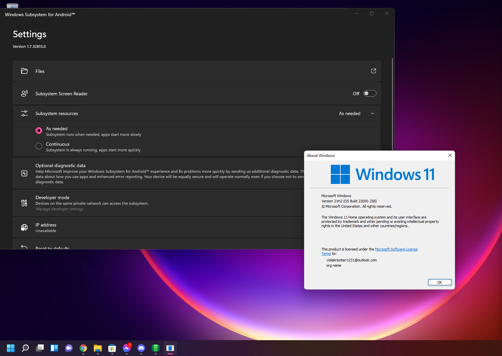

## Windows Subsystem for Android
# About

Windows Subsystem for Android™️ enables your Windows 11 device to run Android applications that are available in the ~~Amazon Appstore~~ your browser with sideloading apk's through adb. Yeah, you can install apps that is in the Amazon store, but it's hell limited.
 

# Requirements
- Windows Subsystem for Android requires Windows 11 v21H2 or newer version.
